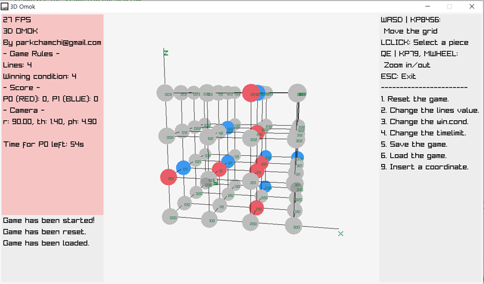

# 3domok
This 2019 project was to create the game of Omok in 3D space.

## Screenshot

## Library used
This project used [Raylib](https://github.com/raysan5/raylib) graphics library.

### Codes
base.c: the base code \
visualscript.c: the game logic code \
visual.c: the visual code (main program)

### By
parkchamchi@gmail.com